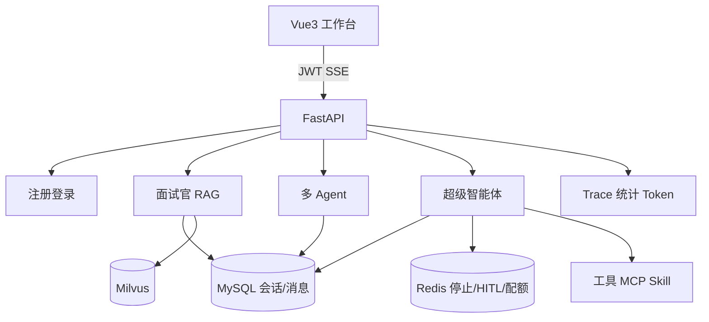

# 枝枝 AI Agent

基于 **Python + LangChain / LangGraph + FastAPI + Milvus + Vue3** 的可演示 Agent 平台。

三个入口互不串会话、互不串产物：**面试官小助手**（RAG）、**多 Agent**（Planner → Worker）、**超级智能体**（工具 / HITL / Skill）。

- 一页架构（面试口述）：[docs/architecture-one-pager.md](docs/architecture-one-pager.md)
- 功能对照（已交付）：[docs/python-roadmap.md](docs/python-roadmap.md)
- 简历 + 模拟面试：[docs/resume-and-interview.md](docs/resume-and-interview.md)

---

## 架构



---

## 三个 Agent（首页点进去即新建该类型对话）

| 入口 | 做什么 | 不用什么 |
|------|--------|----------|
| **面试官小助手** | 流式对话 + 知识库引用（改写 / RRF / Rerank） | 不跑工具、不读 Skill |
| **多 Agent** | Planner 拆步 → 多名 Worker → HITL 导出 txt/pdf/docx | 不走 RAG |
| **超级智能体** | LangGraph `create_agent` 多步工具；Skill 注入 system prompt | 不走 RAG |

左侧历史、右侧产物都按 **当前 Agent 类型** 过滤。

---

## 能力清单

| 能力 | 说明 |
|------|------|
| 鉴权隔离 | JWT；会话 / 知识库 / 产物 / Trace 按 `user_id` |
| 多模型 | 千问 / 豆包 / DeepSeek（工作台下拉） |
| 流式 | SSE `delta` + 前端打字机 |
| RAG | 上传/粘贴 → 多种切片 → Embedding → Milvus；对话带引用卡片 |
| 工具 | 搜索、写 txt、PDF、Word(.docx)、MCP 图片搜索 |
| HITL | 仅写盘工具需批准/拒绝；超时可配置 |
| 停止 | Redis 停止信号 + 前端 Abort |
| 配额 | `AGENT_DAILY_QUOTA`，超限 `QUOTA_EXCEEDED` |
| 配置 | 超级智能体启动时加载/创建 `agent_config`（prompt、工具白名单、超时、HITL） |
| Trace | 列表 + 详情；统计：量、成功率、时延、P95、Prompt/Completion/总 Tokens |
| LangSmith | 可选；`.env` 中 `LANGSMITH_TRACING=true` 且有 Key 才上报，默认关 |
| 评测 | `python evals/run_basic.py --fail-under 0.6` |
| 前端 | `web/` Vue3 + Vite；FastAPI 托管 `web/dist` |

---

## 快速启动

```bash
cp .env.example .env          # 填 Key；MYSQL_ENABLED / REDIS_ENABLED / MILVUS_ENABLED 按需 true
pip install -r requirements.txt   # 或 conda env：zhizhi-ai-agent

docker compose up -d          # MySQL + Redis
# Milvus：docker compose -f docker-compose.milvus.yml up -d
#        或 MILVUS_HOST 指向已有实例

# 建表（库名以 .env MYSQL_DATABASE 为准）
bash scripts/init-mysql.sh    # schema.sql + W2～W4 补丁（含 agent_config）

cd web && npm install && npm run build && cd ..

# 必须在仓库根目录启动，才能读到根目录 .env
uvicorn app.main:app --host 127.0.0.1 --port 8124
# 或：python -m app.main
```

| 地址 | 说明 |
|------|------|
| http://127.0.0.1:8124/ | 首页（选 Agent） |
| http://127.0.0.1:8124/workspace?mode=interviewer | 面试官 |
| http://127.0.0.1:8124/knowledge | 知识库 |
| http://127.0.0.1:8124/trace | Trace 统计 |
| http://127.0.0.1:8124/docs | Swagger |

前端热更新：另开终端 `cd web && npm run dev`（Vite 把 `/api` 代理到 8124）。  
未构建 `web/dist` 时回退 CDN 版 `frontend/`。

本机 Mac Docker 演练（端口 8125，不和手动 8124 冲突）：[docs/deploy-local-mac.md](docs/deploy-local-mac.md)  
`bash scripts/docker-local.sh check && bash scripts/docker-local.sh up`  →  http://127.0.0.1:8125/

阿里云：[docs/deploy-aliyun.md](docs/deploy-aliyun.md)

---

## 三分钟演示

1. **面试官 + RAG**：知识库入库 → 首页进面试官 → 提问 → 看引用卡片。  
2. **超级智能体**：例如「搜资料并生成 PDF」→ HITL 批准 → 产物栏下载（仅本 Agent 文件）。Skill 只在这条链路注入。  
3. **多 Agent**：规划类任务看 Planner / Worker；导出走 HITL。  
4. **Trace**：刷新看成功率、P95、Token（改造前的历史 Trace 可能没有 usage，新请求才会累计）。  
   可选 LangSmith：`.env` 设 `LANGSMITH_TRACING=true` + `LANGSMITH_API_KEY`，到 [smith.langchain.com](https://smith.langchain.com) 看 LLM/工具树；关掉即不上报。

```bash
pytest tests/test_core.py -q
python evals/run_basic.py --fail-under 0.6
```

---

## 目录

```text
app/             FastAPI：鉴权、会话、对话、Agent、知识库、Trace、配额
agent/           超级智能体、多 Agent、HITL、工具、Skill 加载、config_store
web/             Vue3 工作台（首页 / 登录 / 工作台 / 知识库 / Trace）
frontend/        无 dist 时的 CDN 回退页
rag/             切片、Embedding、Milvus、检索、引用
mcp_servers/     图片搜索 MCP
skills/          SKILL.md（仅超级智能体 system prompt）
evals/           20 条基础评测
tests/           核心单测
docs/            架构口述 / 功能对照 / 简历面试
db/              schema.sql + schema_w2～w4
scripts/         init-mysql.sh、Milvus 检查
zhizhi/demo/     学习笔记（非正式产品代码）
```
