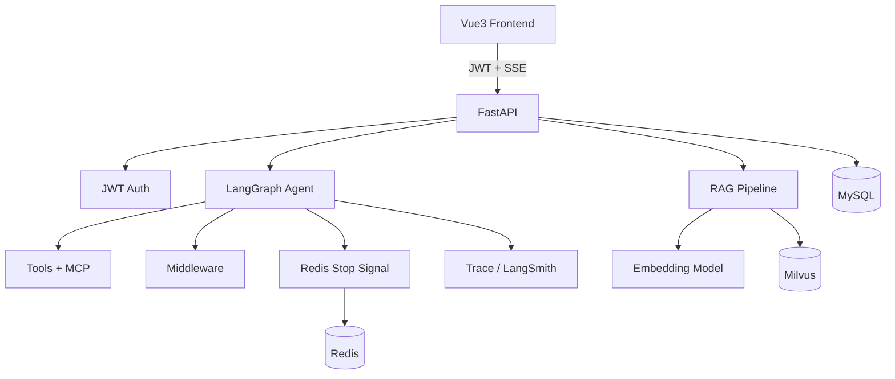

# 枝枝 AI Agent（Python 求职版）路线图

> 基于 Java 版「企业级 Agent 平台」能力规格，按当前 **AI 应用开发工程师 JD** 调整后的 Python 落地计划。  
> 技术栈：**Python + LangChain / LangGraph + FastAPI + Milvus + MCP/Skill + Docker**

---

## 1. 目标一句话（简历）

基于 LangChain/LangGraph 的可演示 Agent 应用：多模型路由、工具调用、**Milvus RAG（含检索优化与引用溯源）**、MCP/Skill 扩展、会话持久化、中间件治理与 Trace/评测，可通过 FastAPI + Docker Compose 一键交付。

---

## 2. 与 Java 版的关系

| 项目 | 定位 |
|------|------|
| Java（IdeaProjects） | 已完成的完整产品向作品（Spring AI + Vue Workspace） |
| Python（本仓库） | **主投 AI 应用岗**作品：LangGraph + Milvus RAG 深度 + MCP/评测 |

同一产品能力，两套技术栈；面试强调迁移与工程落地，而非重复造轮子。

---

## 3. JD 对齐后的功能清单

### 3.1 必做（投简历最低线）

| # | 功能 | 验收标准 |
|---|------|----------|
| 1 | FastAPI 服务 + `.env` 配置外置 | `/health` 可访问；密钥不入库 |
| 2 | JWT 注册登录 + 数据按 userId 隔离 | 无 token → 401 |
| 3 | 会话 / 消息 MySQL 持久化 | 刷新后续聊 |
| 4 | Redis 停止信号 + Agent 可取消 | 点停止后不再继续 step |
| 5 | LangGraph `create_agent` + 工具调用 + SSE | 多步工具任务可演示 |
| 6 | **Milvus RAG 全链路** | 上传→切片→Embedding→检索→对话引用 |
| 7 | **检索优化至少 2 项** | 查询改写 / 混合检索 / Rerank 中完成 ≥2 |
| 8 | 工具审计 + 产物下载 | 库中有审计；PDF/文件可下载 |
| 9 | Trace（TraceId / Token / 耗时） | 有列表或统计页/接口 |
| 10 | Docker Compose | MySQL + Redis + Milvus（etcd/minio）可启动 |
| 11 | README + 架构图 + Demo 视频脚本 | 他人可按文档跑通 |

### 3.2 加分（选做 2～3 个）

| 功能 | 说明 |
|------|------|
| MCP | 独立 FastMCP（如图片搜索）+ Agent 侧接入 |
| Skill | `skills/*/SKILL.md` 可插拔能力说明 |
| HITL | 终端/写文件二次确认 |
| 评测集 | `evals/` 约 20 条 + 简单跑分（可接 Ragas） |
| Multi-Agent | Planner → Worker 最小链路 |
| LangSmith | 链路追踪与排障 |

### 3.3 明确不做

- 计费 / 复杂运营后台  
- Dify 级可视化 Workflow 编排器  
- Computer Use / 插件市场  
- 重度前端打磨（2～3 个核心页即可）

---

## 4. 目标技术架构

```text
Vue3（精简：对话 / 知识库 / Trace）
        ↓ JWT + SSE
FastAPI
  ├── Auth / Conversations / Knowledge / Artifacts / Traces / HITL
  ├── Agent（LangGraph create_agent）
  │     ├── Tools + MCP Tools
  │     ├── Retriever Tool（Milvus）
  │     ├── Middleware：Summarization / HITL / Fallback / Limit
  │     └── Checkpointer + Redis stop
  └── RAG：Load → Split → Embedding → Milvus
        （Query Rewrite / Hybrid or Rerank）
```



---

## 5. 仓库目录（目标结构）

```text
zhizhi-ai-agent/                 # 本仓库
├── app/                         # FastAPI 入口与路由
├── agent/                       # LangGraph agent、middleware、tools
├── rag/                         # split、embedding、milvus、retrieve
├── mcp/                         # MCP servers（如 image-search）
├── skills/                      # Skill 定义
├── evals/                       # 评测集与脚本
├── frontend/                    # 精简 Vue（可后期从 Java 前端裁剪）
├── zhizhi/demo/                 # 现有 notebook 学习笔记（保留）
├── docs/
│   ├── python-roadmap.md        # 本文件
│   ├── architecture.md          # 架构说明（W4 补）
│   ├── demo-script.md           # 演示口播（W4 补）
│   └── resume-bullets.md        # 简历条目（W4 补）
├── docker-compose.yml           # mysql + redis + milvus
├── .env.example
├── requirements.txt
└── README.md
```

---

## 6. 全职冲刺计划（3～4 周）

节奏：每天 6～8 小时有效编码。

### 第 1 周：工程底盘

| 天 | 任务 | 验收 |
|----|------|------|
| **D1** | 工程骨架：`app/` FastAPI、`.env.example`、README 初稿、目录创建 | `uvicorn` 启动，`GET /health` = ok |
| **D2** | MySQL：`user` / `conversation` / `message` + CRUD API | Postman 能建会话、落消息 |
| **D3** | 前端历史侧栏 + chatId（可先用最简 HTML/Vue） | 刷新后历史可续聊 |
| **D4** | JWT 注册登录、接口鉴权 | 无 token → 401 |
| **D5** | Redis 停止信号 + Agent 循环可取消；Compose 起 MySQL+Redis | 点停止后不再继续 step |

### 第 2 周：RAG + Agent（JD 核心）

| 天 | 任务 | 验收 |
|----|------|------|
| **D1** | 云服务器 / 本地 Compose 拉起 Milvus standalone（etcd+minio+milvus） | 本机 `19530` 可连；pymilvus 通 |
| **D2** | Embedding + 写入/检索 Milvus 脚本与模块 | 给定 query 能返回相关 chunk |
| **D3** | 知识库上传 API + 对话注入检索 + 引用（`__CITATIONS__`） | 回答能展示来自哪篇文档 |
| **D4** | 检索优化：查询改写 +（混合检索 **或** Rerank） | 对比优化前后 5 条 case 有提升说明 |
| **D5** | `create_agent` + 核心工具（搜索/文件/PDF）+ 审计/产物 | 多步任务可跑；产物可下载 |

### 第 3 周：中间件 + MCP/Skill + 可观测

| 天 | 任务 | 验收 |
|----|------|------|
| **D1** | SummarizationMiddleware / 短记忆压缩 | 长对话可摘要且可续聊 |
| **D2** | 对话页可用（思考/工具/回答分区或日志展示） | 可截图上简历 |
| **D3** | HITL **或** ModelFallback（二选一优先 HITL） | 危险工具可拒绝/允许 |
| **D4** | MCP 图片搜索 + 2 个 Skill 包 | 简历可写 MCP / Skill |
| **D5** | Trace 接口/页 + `evals/` 20 条基础评测 | 能回答单次耗时与简单质量回归 |

### 第 4 周：包装投递

| 天 | 任务 |
|----|------|
| **D1** | README 架构图、启动步骤、3 个演示场景 |
| **D2** | 录 3～5 分钟 Demo；准备 1 页架构讲解 |
| **D3** | Planner → Worker 多 Agent 最小链路（可选） |
| **D4** | 稳定性（停止/超时/错误提示）+ 核心单测 |
| **D5** | 简历条目 + 模拟面试问答 |

### 3 周极速版（可砍）

**可砍：** HITL、MCP、Skill、Trace 页、多 Agent、精美前端。  
**不能砍：** 登录会话、可取消、**Milvus RAG + 引用 + 至少一项检索优化**、Agent 工具、Compose、README/视频。

---

## 7. 三个演示场景（投递用）

### 场景 1：知识库 RAG（主打）

| 项 | 内容 |
|----|------|
| 步骤 | 上传文档 → 提问文档内容 |
| 预期 | 回答含引用片段；可说明切片/Embedding/Milvus/改写或 Rerank |

### 场景 2：Agent 工具调用

| 项 | 内容 |
|----|------|
| Prompt | 搜索/写文件/生成 PDF 类任务 |
| 预期 | 展示工具调用过程；产物可下载；可选 HITL |

### 场景 3：可观测 / 停止

| 项 | 内容 |
|----|------|
| 步骤 | 长任务中点停止；打开 Trace |
| 预期 | 停止生效；可见 TraceId、Token、耗时 |

---

## 8. 环境变量（`.env.example` 草案）

| 变量 | 用途 |
|------|------|
| `DASHSCOPE_API_KEY` | 通义（对话 / Embedding） |
| `DEEPSEEK_API_KEY` | DeepSeek |
| `ARK_API_KEY` / 豆包相关 | 可选多模型 |
| `MYSQL_*` | 会话库 |
| `REDIS_*` | 停止信号 |
| `MILVUS_HOST` / `MILVUS_PORT` | 默认 `127.0.0.1:19530` |
| `EMBEDDING_MODEL` | 如 `text-embedding-v3` |
| `LANGSMITH_*` | 可选 |
| `MCP_ENABLED` | 是否挂载 MCP 工具 |
| `JWT_SECRET` | 鉴权 |

---

## 9. 进度追踪

| 里程碑 | 状态 |
|--------|------|
| W0 路线图与仓库骨架 | 🔄 进行中 |
| W1 工程底盘 | ⬜ |
| W2 Milvus RAG + Agent | ⬜ |
| W3 MCP/Skill/Trace/Eval | ⬜ |
| W4 Demo / 简历包装 | ⬜ |

每完成一天，将上表对应行改为 ✅，并在提交说明中引用验收标准。

---

## 10. 今日立即执行（W1 D1 开工清单）

1. 确认本文件与目录骨架已存在  
2. 补齐 `.env.example`、`README.md` 初稿、`app/main.py` 的 `/health`  
3. 同步推进云服务器 **Milvus compose（etcd+minio+milvus）**，为 W2 铺路  
4. 不要继续堆无关 notebook；学习笔记保留在 `zhizhi/demo/`，正式功能进 `app/` / `agent/` / `rag/`

---

## 11. 简历差异表述（备用）

- **Java 版**：Spring 生态企业工程、完整 Workspace、HITL/MCP/Trace 产品闭环  
- **Python 版**：LangChain/LangGraph 主流 Agent 栈、Milvus RAG 与检索优化、MCP/Skill、评测与可观测、FastAPI 可部署交付  
